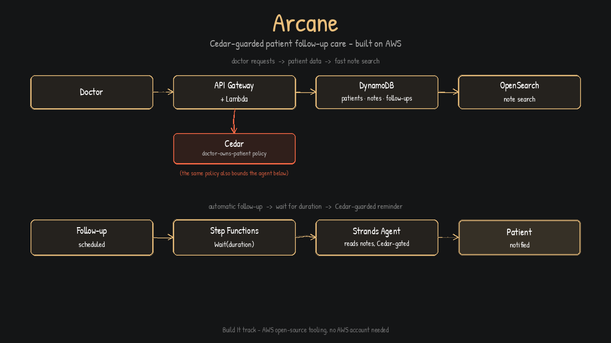
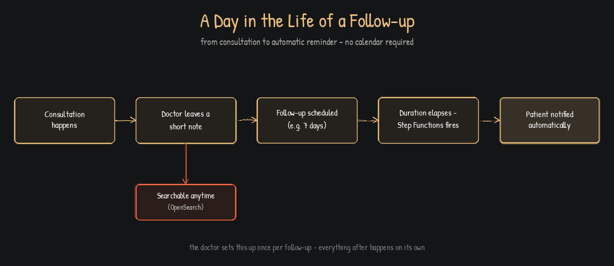
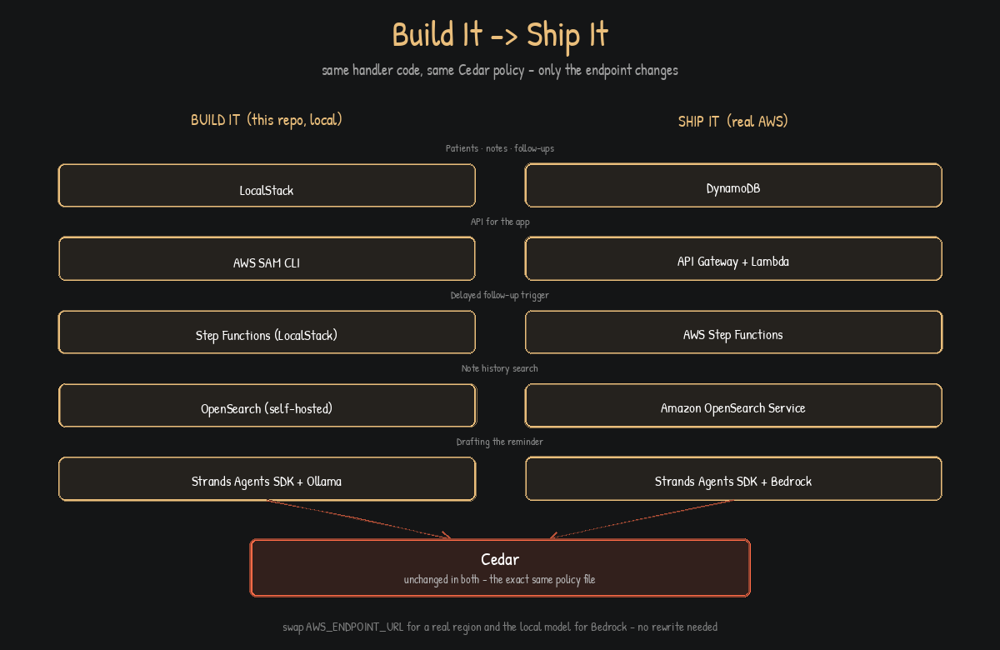
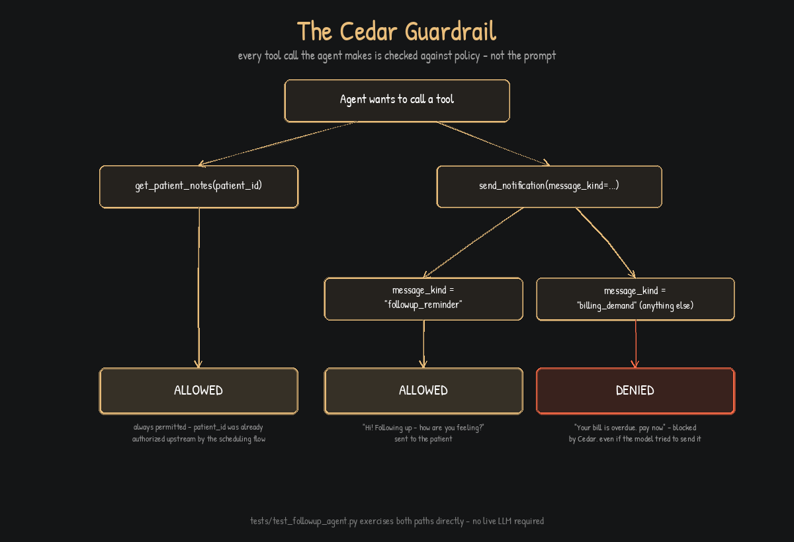

# Adios

Adios helps doctors keep track of patient follow-ups and long-term
consultation notes — and automatically reminds the patient when a follow-up
is due, so nothing gets missed because someone forgot to check a calendar.

Built for the AWS + WeMakeDevs "First Commit" hackathon (Build It track —
runs entirely on your own machine, no AWS account or credit card needed).



## What you get

- **A record per patient** with your short notes from every visit, so on a
  follow-up call you can scan their history in seconds instead of trying to
  remember or dig through paper charts.
- **Search across a patient's notes** ("swelling", "blood pressure", …) to
  find the relevant visit fast.
- **Set-and-forget follow-ups**: tell it "check back on this patient in 7
  days" once, and the patient gets an automatic reminder when that day
  comes — you don't have to track it yourself.
- **Only you (and doctors you work with) can see your own patients.** Access
  is enforced by policy, not just convention — a colleague can't
  accidentally pull up your patient's notes.

## Try it on your own machine (2 minutes, no setup)

You need Python 3.10+ and `curl` (or Postman, if you prefer a UI for
trying requests).

```bash
git clone <this-repo-url>
cd Arcane
pip install -r requirements.txt
make cli
```

`make cli` opens a simple numbered menu - view your patients, add a note,
search a patient's history, schedule a follow-up - no curl or JSON needed.
It's the fastest way to see how this actually feels to use day to day.

Option 7 in that menu ("Check for due follow-ups now") is where the Strands
Agent and Cedar actually run - it reads the patient's notes, drafts the
reminder, and every tool call it makes is checked against the same Cedar
policy file that guards doctor access. By default it drafts with a fixed
template so this works with no extra setup. To have the agent's own local
model draft the message instead: `ollama serve`, pull any tool-calling model
(the repo defaults to `gemma4:e2b`), then run with `ADIOS_USE_LLM=1 make cli`.

The rest of this section uses the HTTP API instead (`make run`), which is
useful if you want to see the actual request/response shape, or wire this up
to something else.

```bash
make run
```

This starts a local server at `http://localhost:8000` and automatically
loads a few realistic sample patients so there's something to look at
immediately — you'll see their patient IDs printed in the terminal, e.g.:

```
  Asha Rao     patient_id=pat_06f6fc2be39a  (Dr. Priya Mehta (Orthopedics), follow-up pending)
  Vikram Nair  patient_id=pat_82faf6dfb39c  (Dr. Priya Mehta (Orthopedics), follow-up pending)
  Meera Iyer   patient_id=pat_cbe5a4a9042e  (Dr. Imran Khan (General Medicine), follow-up pending)
  Rohan Das    patient_id=pat_a54aaff36601  (Dr. Imran Khan (General Medicine), follow-up pending)
```

Copy one of those `patient_id` values and try the everyday workflow:

**Look up a patient and their note history**
```bash
curl -H "X-Doctor-Id: dr_mehta" http://localhost:8000/patients/<patient_id>
curl -H "X-Doctor-Id: dr_mehta" http://localhost:8000/patients/<patient_id>/notes
```

**Search their notes for something specific**
```bash
curl -H "X-Doctor-Id: dr_mehta" "http://localhost:8000/patients/<patient_id>/notes?q=swelling"
```

**Add a short note after a consultation**
```bash
curl -X POST -H "X-Doctor-Id: dr_mehta" -H "Content-Type: application/json" \
  -d '{"text":"Patient reports feeling much better today."}' \
  http://localhost:8000/patients/<patient_id>/notes
```

**Register a new patient**
```bash
curl -X POST -H "X-Doctor-Id: dr_mehta" -H "Content-Type: application/json" \
  -d '{"name":"New Patient","contact":"patient@example.com"}' \
  http://localhost:8000/patients
```

**Schedule a follow-up (in days from now)**
```bash
curl -X POST -H "X-Doctor-Id: dr_mehta" -H "Content-Type: application/json" \
  -d '{"durationDays":7}' \
  http://localhost:8000/patients/<patient_id>/followups
```
When that many days pass, the patient is notified automatically — watch the
terminal running `make run`, it checks for due follow-ups every few seconds
and logs each reminder it sends (the sample data includes one that's already
due, so you'll see this fire within seconds of starting the server).

**Try accessing a patient that isn't yours** — swap `X-Doctor-Id` to a
different doctor (e.g. `dr_khan` on one of Dr. Mehta's patients) and you'll
get a `403`. That's intentional: patient records are only visible to their
own doctor.

> `X-Doctor-Id` stands in for a login for this MVP — there's no sign-in
> screen yet, so pick any doctor ID you like when trying it out. See
> [What's next](#whats-next-post-mvp) for adding real accounts.

Run the automated test suite any time with `make test`.



## The AWS stack

Everything below runs locally through AWS's own open-source tooling (Build
It track) — the same code moves to real AWS (Ship It track) by pointing it
at a real endpoint instead of localhost, no rewrite needed.

| Need                                       | AWS service          | Local (Build It) stand-in            |
|---------------------------------------------|-----------------------|----------------------------------------|
| Store patients, notes, follow-ups           | DynamoDB              | LocalStack                             |
| API for the app to talk to                  | API Gateway + Lambda  | AWS SAM CLI (`samlocal`)               |
| Wait N days, then trigger the reminder      | Step Functions        | LocalStack                             |
| Search a patient's note history             | OpenSearch            | OpenSearch (self-hosted, via Finch)    |
| "Only the treating doctor can see this"     | Cedar                 | Cedar (`cedarpy`), runs anywhere       |
| Drafting the personalized reminder message  | Bedrock               | Strands Agents SDK + Ollama (local LLM)|
| Container runtime for the above             | —                     | Finch                                  |



`make run` (what you just used above) skips all of this infrastructure and
runs against local, in-memory/file-based fallbacks instead — that's what
makes the 2-minute quick start possible. To run against the real local AWS
stack (LocalStack DynamoDB, real OpenSearch, Step Functions actually
orchestrating the wait):

```bash
make infra-up     # starts LocalStack + OpenSearch (via Finch or Docker)
pip install aws-sam-cli-local
make deploy       # deploys infra/template.yaml to LocalStack
```

## Why access control isn't an afterthought here



Patient notes are sensitive. The rule — *a doctor may only see patients they
actually treat* — is enforced by a real policy engine (Cedar), defined once
in [`src/adios/auth/policies.cedar`](src/adios/auth/policies.cedar), and
checked on every request. It's not a `if user.id == patient.doctor_id` check
copy-pasted through the codebase that someone could forget in a new
endpoint — it's one file, one rule, applied everywhere automatically. The
same policy file also limits what the automated reminder agent is allowed to
do: it can read a patient's notes and send one specific kind of message
(a follow-up reminder), and nothing else, even if something in the AI's
prompt tried to push it further. See
[`tests/test_followup_agent.py`](tests/test_followup_agent.py) for both the
allowed and blocked paths.

## Project layout

```
src/adios/
  models.py, repository.py, db.py     - patient/note/follow-up data layer
  search.py                            - OpenSearch-backed note search
  auth/policies.cedar, authorize.py    - doctor-owns-patient access control
  agent/                               - the Cedar-guarded follow-up agent
  handlers/                            - Lambda handlers behind API Gateway
infra/
  template.yaml                        - SAM template (tables, functions, API)
  statemachine/followup_flow.asl.json  - Wait -> notify Step Functions flow
  docker-compose.yml                   - LocalStack + OpenSearch
scripts/
  local_server.py                      - single-command local server + demo data
  seed_demo_data.py                    - realistic sample doctors/patients/notes
  run_demo.py                          - scripted end-to-end walkthrough
tests/                                 - auth, repository, and agent guardrail tests
```

## What's next (post-MVP)

- Real doctor sign-in (Cognito) instead of the `X-Doctor-Id` header
- A simple web UI for doctors instead of curl/API calls
- Patient-facing reply channel (SMS/WhatsApp) instead of a logged reminder
- Care-team roles (e.g. nurse: read-only) — the Cedar policy already
  extends cleanly to a second role
- Ship It track: swap `AWS_ENDPOINT_URL` for a real AWS region and the local
  Ollama model for Bedrock
